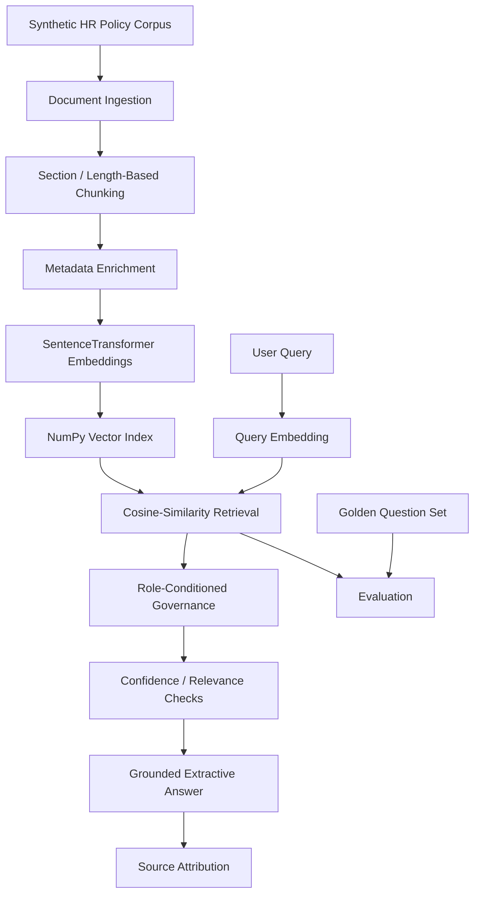
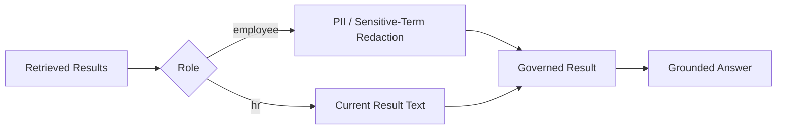

# HR AI Content System

### Governed Enterprise Retrieval · PII Protection · Semantic Search · Evaluation

HR AI Content System is a Python-based enterprise retrieval and governance project exploring how knowledge systems can combine **semantic retrieval, sensitive-data protection, role-conditioned behavior, grounded responses, and measurable evaluation**.

The project uses a synthetic HR policy corpus so retrieval and governance behavior can be demonstrated without exposing real employee data.

> **Project focus:** Governed Enterprise AI Retrieval + Evaluation

---

## Problem

Enterprise retrieval systems need to do more than return semantically similar text.

A useful internal knowledge system should also address questions such as:

- Does retrieved content contain sensitive information?
- Should the returned text change based on the user role?
- Is the answer grounded in approved source material?
- Can unrelated questions be rejected instead of answered confidently?
- Can retrieval behavior be measured against a repeatable evaluation set?
- Can governance behavior be tested independently from the retrieval model?

HR AI Content System provides a compact environment for developing and testing those concerns.

---

## System Architecture



The current implementation is intentionally small and inspectable: retrieval, governance, answer construction, and evaluation are separated into independent pipeline modules.

---

## Implemented Capabilities

### Document Ingestion

The pipeline loads synthetic HR policy text from the local dataset and passes it through the retrieval preparation flow.

### Chunking

Documents are split using section boundaries and a simple length-based accumulation strategy.

The chunking layer is deterministic and independently tested.

### Metadata Enrichment

Each chunk receives metadata including:

- chunk ID
- detected policy title
- chunk length
- source identifier

The current metadata classifier recognizes policy areas such as:

- Employee Benefits
- Parental Leave
- Sick Leave
- Remote Work
- Confidentiality
- Code of Conduct
- Benefits Enrollment
- Manager Approval
- Termination
- Data Privacy

### Semantic Embeddings

The project uses:

```text
Sentence Transformers
└── all-MiniLM-L6-v2
```

Chunk embeddings and query embeddings are generated through the same model.

### Vector Retrieval

The retrieval layer uses:

- NumPy for the in-memory vector representation
- scikit-learn cosine similarity
- descending similarity ranking
- configurable `top_k`

The current implementation uses a lightweight in-memory index rather than an external vector database.

### PII / Sensitive-Term Redaction

The governance layer includes deterministic redaction for:

- SSN-pattern values
- the term `SSN`
- the term `salary`

Matching for configured sensitive terms is case-insensitive.

Example:

```text
123-45-6789
      ↓
[REDACTED_SSN]
```

### Role-Conditioned Result Transformation

The application supports two example roles:

```text
employee
hr
```

For the `employee` role, retrieved content is passed through redaction before being returned.

The current implementation is best described as **role-conditioned redaction**.

It is **not** a complete RBAC or authorization system because retrieval itself is not yet filtered by document-level permissions.

### Grounded Extractive Answering

The current answer layer is deterministic and extractive.

It:

1. selects the top retrieved result
2. checks similarity thresholds
3. extracts a short answer from retrieved policy text
4. returns the detected source title
5. includes the retrieval confidence score

The project does **not** currently use an LLM to generate the response.

### Relevance / Confidence Handling

The application uses similarity thresholds to distinguish between:

- sufficiently relevant HR questions
- lower-confidence questions
- questions that appear outside the HR knowledge base

This provides a simple refusal / relevance boundary rather than forcing an answer for every query.

### Gradio Interface

The repository includes a Gradio application with:

- HR question input
- role selection
- answer display
- evaluation tab

This keeps the retrieval and governance pipeline directly inspectable through a lightweight UI.

---

## Governance Model



The current design demonstrates governance **after retrieval**.

A future RBAC-aware version would move authorization earlier in the pipeline:

```text
Query
  ↓
User / Role Context
  ↓
Authorization-Aware Filtering
  ↓
Retrieval
  ↓
PII Controls
  ↓
Grounded Answer
```

That distinction is important: **role-conditioned redaction is implemented; true RBAC-aware retrieval is not yet implemented.**

---

## Evaluation

The project includes a small golden-question evaluation framework.

The current golden set contains:

- **16 HR-domain questions**
- **5 unrelated / out-of-domain questions**

Examples evaluate topics such as:

- PTO
- parental leave
- sick leave
- remote work
- confidentiality
- benefits
- manager approval
- termination / resignation
- employee-data privacy
- unrelated questions that should not be treated as HR knowledge

The current evaluation framework checks expected answer signals and safe handling of irrelevant questions.

It is intentionally lightweight and is a foundation for more formal retrieval and governance benchmarking.

---

## Research Direction

The next research question is:

> **How does governance affect enterprise retrieval quality, sensitive-data leakage risk, access-control correctness, and answer usefulness?**

The planned benchmark compares:

```text
Standard Retrieval
        vs
PII-Filtered Retrieval
        vs
PII + Authorization-Aware Retrieval
```

Target measurements include:

- Recall@K
- MRR
- NDCG
- sensitive-data leakage rate
- access-denial correctness
- answer usefulness
- retrieval regression behavior

These benchmark metrics are roadmap targets and are **not claimed as currently implemented**.

---

## Testing

The current repository includes **17 automated tests** across unit and integration coverage.

The tests exercise:

- chunking
- metadata enrichment
- PII redaction
- case-insensitive sensitive-term handling
- role-conditioned governance
- vector index construction
- cosine-similarity retrieval
- evaluation behavior
- document preparation pipeline

Run:

```bash
python3 -m pytest -q
```

---

## Continuous Integration

GitHub Actions validates the repository on pushes and pull requests to `main`.

The CI flow performs:

```text
Checkout
   ↓
Python 3.11 setup
   ↓
Install dependencies
   ↓
Compile Python
   ↓
pytest
```

---

## Synthetic Dataset

`data/sample_hr_docs.txt` contains synthetic policy content covering areas such as:

- PTO
- parental leave
- sick leave
- remote work
- confidentiality
- benefits enrollment
- manager approvals
- termination / resignation
- employee-data privacy

The project does not require real employee records.

---

## Technology Stack

- **Python**
- **Gradio**
- **Sentence Transformers**
- **all-MiniLM-L6-v2**
- **NumPy**
- **scikit-learn**
- **pytest**
- **GitHub Actions**
- **Git**

---

## Repository Structure

```text
HR-ai-content-system/
├── .github/
│   └── workflows/
│       └── ci.yml
├── app.py
├── data/
│   └── sample_hr_docs.txt
├── docs/
├── pipeline/
│   ├── __init__.py
│   ├── chunking.py
│   ├── embeddings.py
│   ├── evaluation.py
│   ├── governance.py
│   ├── ingestion.py
│   ├── metadata.py
│   └── retrieval.py
├── scripts/
├── tests/
│   ├── integration/
│   └── unit/
├── pytest.ini
├── requirements.txt
└── README.md
```

---

## Running Locally

Create a virtual environment:

```bash
python3 -m venv .venv
source .venv/bin/activate
```

Install dependencies:

```bash
pip install -r requirements.txt
```

Run the tests:

```bash
python3 -m pytest -q
```

Run the Gradio application:

```bash
python3 app.py
```

---

## Current Scope

The current repository demonstrates:

- synthetic HR document ingestion
- section / length-based chunking
- metadata enrichment
- SentenceTransformer embeddings
- NumPy-backed semantic retrieval
- cosine-similarity ranking
- deterministic PII / sensitive-term redaction
- role-conditioned result transformation
- grounded extractive answers
- source attribution
- similarity-based relevance checks
- a lightweight golden-question evaluation framework
- Gradio UI
- automated tests
- GitHub Actions CI

It does **not** currently claim:

- production employee data
- enterprise identity integration
- document-level authorization
- true RBAC-aware retrieval filtering
- policy-engine integration
- LLM-generated answers
- vector-database infrastructure
- production security controls
- production HR decision automation

---

## Roadmap

### Governance

- document-level authorization policies
- true RBAC-aware retrieval filtering
- explicit access-denial tests
- broader PII leakage tests
- governance regression testing

### Evaluation

- larger synthetic HR corpus
- larger golden dataset
- Recall@K
- MRR
- NDCG
- leakage-rate measurement
- access-denial correctness
- reproducible benchmark reports

### Retrieval

- retrieval regression suite
- additional retrieval strategies for controlled comparison
- governance-aware retrieval experiments

### Engineering

- Docker
- reproducible benchmark command / report generation
- CI expansion where useful

Roadmap items are **not claimed as implemented** until corresponding evidence exists.

---

## Why This Project Matters

Many enterprise RAG and semantic-search demos optimize only for relevance:

```text
Query → Retrieve → Answer
```

Enterprise systems often need a broader view:

```text
Query
  ↓
Retrieval
  ↓
Governance
  ↓
Sensitive-Data Controls
  ↓
Grounded Answer
  ↓
Evaluation
```

HR AI Content System demonstrates that retrieval quality and governance should be considered together rather than as separate concerns.

That makes the project especially relevant to:

- enterprise AI
- responsible AI
- governed knowledge systems
- retrieval evaluation
- privacy-aware application design
- research-oriented AI engineering

---

## Important Note

This project is a **portfolio / research engineering showcase** using synthetic HR policy content.

It is not an operational HR decision system and should not be used for employment, compensation, disciplinary, termination, benefits, or other personnel decisions.

No real employee records, production HR databases, payroll data, private resumes, or production credentials are intended to be included in this repository.

---

## Portfolio Context

HR AI Content System is the portfolio's primary project for **governed enterprise retrieval, privacy-aware AI, and retrieval evaluation**.

Related portfolio areas include:

- Agentic AI and AI platform engineering
- pharmaceutical / regulated document intelligence
- backend/API engineering
- full-stack AI products
- workflow reliability and systems engineering

**Chaitanya Sai — Applied AI Engineer**

Generative AI · LLMs · RAG · Agentic AI · AI Platform & Backend Engineering

[Portfolio](https://chaitanya-sai-portfolio.vercel.app) · [GitHub](https://github.com/chaitanyaAI-careers) · [LinkedIn](https://www.linkedin.com/in/chaitanyaai-careers/)
